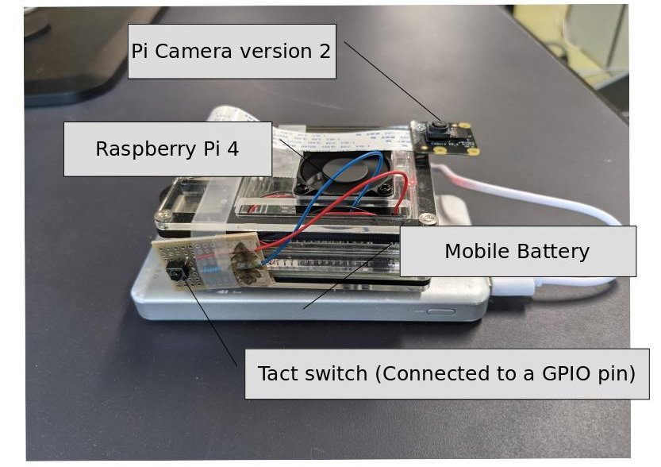

# rpi_button_cam
Getting raw images with Pi Camera v2, using a tact switch as a shutter button 

## Hardware Example
 
This scripts works only with [Pi Camera Module Version 2](https://www.raspberrypi.org/products/camera-module-v2/). A tact switch is used as a shutter button.
## Usage
```
git clone https://github.com/0kam/rpi_button_cam
cd rpi_button_cam
chmod +x button_camera.py
./button_camera.py -o $output_directory$ -g $GPIO_pin_number$
```
### Basic Arguments (required)
- "-o", "--out", type=str, help="Output directory"
- "-g", "--gpio", type=int, help="GPIO number connected to the shutter button"
### Optional Arguments
- "-b", "--bayer", action="store_true", default=False, help="Return Bayer array (Default: Return demosaiced array)"
- "-t", "--type", type=str, default="uint8", help="Data type of the result. uint8 or uint16. If uint16, 10bit raw data will returned as np.uint16 array."
- "-p", "--preview", type=int, default=0, help="Preview time in seconds. If 0, preview will not be activated."
